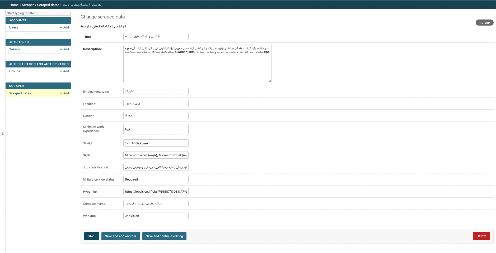
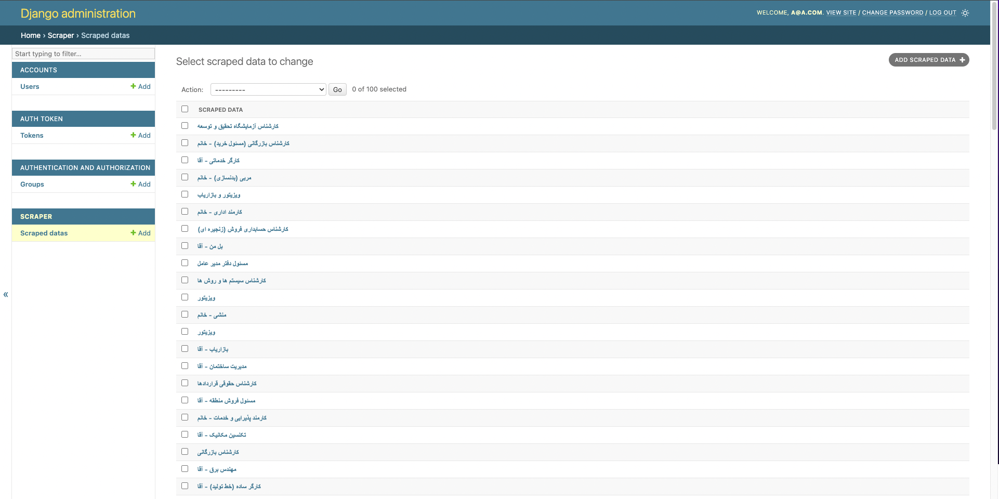
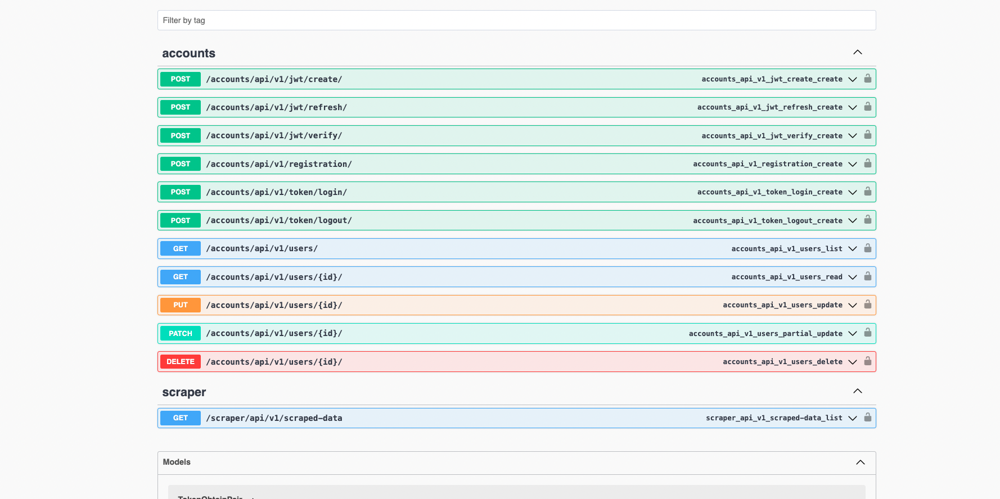
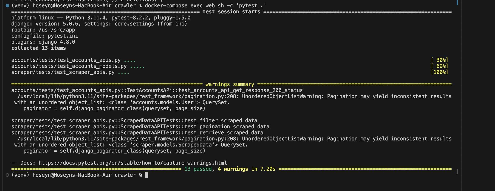

# Crawler
## محتویات فایل .env در دایرکتوری /core/
```env
SECRET_KEY=django-insecure-lu3q-&w05blxicjw1rm3lurlxnz6u@t0ge28h62!_2e80g+zrj
SQL_DATABASE=crawler
SQL_USER=admin
SQL_PASSWORD=@dmin2321
SQL_HOST=db
SQL_PORT=5432


POSTGRES_USER=admin
POSTGRES_PASSWORD=@dmin2321
POSTGRES_DB=crawler
```

<div dir="rtl">

## فهرست موضوعات
- [نحوه اجرا](#نحوه-اجرا)
- [تنظیمات دیتابیس](#تنظیمات-دیتابیس)
- [راهنمای داکر](#راهنمای-داکر)
- [اجرای دستورات و استخراج اطلاعات از jobvision و joninja](#اجرای-دستورات-و-استخراج-اطلاعات-از-jobvision-و-joninja)
- [راهنمای وب سرویس](#راهنمای-وب-سرویس)
- [ابزار های مورد استفاده](#ابزار-های-مورد-استفاده)
-  [تسک های زمان بندی شده](#تسک-های-زمان-بندی-شده)

- [Unit test & Pytest](#unit-test--pytest)

## نحوه اجرا
برای اجرای پروژه در ابتدا پروژه باید از گیت هاب کلون شود 
   ```bash
git clone 'https://github.com/hoseyn-chegeni/crawler.git'
 ```

 توجه داشته باشید که پیش از اجرای پروژه تنظیمات دیتابیس باید انجام شود <br> 
 برای تنظیم دیتابیس به بخش  [تنظیمات دیتابیس](تنظیمات-دیتابیس) مراجعه نمایید <br> 
سپس دستور زیر را اجرا نمایید 

   ```bash
      docker-compose up --build
   ```
 سپس برای اجری تسک های زمان بندی شده از دستور زیر را اجرا نمایید 
   ```bash
      docker-compose exec web sh -c 'celery -A core beat -l info'
   ```


## تنظیمات دیتابیس
برای اجرا و اتصال دیتابیس postgresql  به پروژه دستورات  زیر را اجرا نمایید 

   ```bash
      sudo -i -u postgres
   ```
   ```bash
      psql
   ```
سپس با دستور زیر دیتابیس پروژه را ایجاد نمابیید
   ```bash
  CREATE DATABASE <db_name>;
   ```
ایجاد یوزر برای دیتابیس 
   ```bash
  CREATE USER myuser WITH PASSWORD 'mypassword';
   ```
سپس با اجرای دستورات زیر تمام دسترسی های لازم را به کاربر دیتابیس بدهید 
   ```bash
GRANT ALL PRIVILEGES ON DATABASE myproject TO myuser;
   ```
   ```bash
GRANT ALL PRIVILEGES ON SCHEMA public TO myuser;
   ```
   ```bash
GRANT ALL PRIVILEGES ON ALL TABLES IN SCHEMA public TO myuser;
   ```

   ```bash
GRANT ALL PRIVILEGES ON ALL SEQUENCES IN SCHEMA public TO myuser;
   ```
سپس اطلاعات دیتابیس را در فایل  .env قرار دهید <br> 
توجه داشته باشید که در فایل settings.py تنظیمات دیتابیس باید تغییر کند تا پروژه به جای استفاده از  sqlite3  به دیتابیس مورد نظر متصل شود 

   ```python
DATABASES = {
    "default": {
        "ENGINE": "django.db.backends.postgresql",
        "NAME": os.getenv("SQL_DATABASE"),
        "USER": os.getenv("SQL_USER"),
        "PASSWORD": os.getenv("SQL_PASSWORD"),
        "HOST": os.getenv("SQL_HOST"),
        "PORT": os.getenv("SQL_PORT", "5432"),
        "ATOMIC_REQUESTS": True,
    }
}
```
برای مشاهده جداول و اطلاعات دیتابیس از طریق ترمینال مطابق دستورات زیر عمل کنید<br> 
اتصال به کانتیر دیتابیس

   ```bash
docker exec -it your_container_name psql -U <user> -d <db_name>
   ```
لیست دیتابیس های موجود
   ```bash
\l
   ```
اتصال به دیتابیس پروژه
   ```bash
\c <db_name>
   ```
لیست جدول ها
   ```bash
\dt

   ```
اجرای query 
   ```bash
SELECT * FROM table_name;
   ```


## راهنمای داکر
تنظیمات داکر در پروژه با استفاده از پیکربندی Dockerfile  و Docker Compose صورت گرفته است. 
   ```Dockerfile
# pull official base image
FROM python:3.11.4-slim-buster

# set work directory
WORKDIR /usr/src/app

# set environment variables
ENV PYTHONDONTWRITEBYTECODE=1
ENV PYTHONUNBUFFERED=1

# install system dependencies
RUN apt-get update && apt-get install -y netcat

# install dependencies
RUN pip install --upgrade pip
COPY ./requirements.txt .
RUN pip install -r requirements.txt

# copy entrypoint.sh
COPY ./entrypoint.sh .
RUN chmod +x /usr/src/app/entrypoint.sh

# copy project
COPY . .

# run entrypoint.sh
ENTRYPOINT ["/usr/src/app/entrypoint.sh"]
CMD ["python", "manage.py", "runserver", "0.0.0.0:8000"]
 ```
این اسکریپت در ابتدا محیط پایتون را در یک کانتیر راه اندازی می کند سپس  dependency ها را نصب میگند  پکیج های نام برده در فایل  requirements.txt  نصب کرده و سپس فایل های پروژه را در کانتیر کپی کرده و سرور چنگو را راه اندازی میکنید 

   ```yml
version: '3.8'

services:
  redis:
    container_name: redis
    image: redis:7.0.11-alpine

  web:
    build: ./core
    command: ["python", "manage.py", "runserver", "0.0.0.0:8000"]
    volumes:
      - ./core/:/usr/src/app/
    ports:
      - "8000:8000"
    env_file:
      - ./core/.env
    depends_on:
      - db
      - redis

  celery:
    container_name: celery
    build:
      context: ./core
    command: celery --app=core worker -l INFO 
    env_file:
      - ./core/.env
    volumes:
      - ./core:/usr/src/app
    depends_on:
      - redis
      - db

  db:
    container_name: db
    image: postgres:15
    volumes:
      - postgres_data:/var/lib/postgresql/data/
    env_file:
      - ./core/.env

volumes:
  postgres_data:

 ```
فایل Docker Compose  سرویس های به کار رفته در پروژه پیکربندی کرده و dependency  های میان سرویس ها را تنظیم و volume هایی برای ذخیره کردن داده های مهم فراهم میکند <br> 
این فایل شامل پروژه اصلی با نام web  دیتابیس پروژه با نام  db و سرویس های  redis و  celery   برای انجام تسک های زمان بندی شده است <br> 


## اجرای دستورات و استخراج اطلاعات از jobvision و joninja
تسک های اصلی برای استخراج داده از سایت های مورد نظر از طریق ابزار  scrapy  تعریف شده اند که دایرکتوری اصلی برنامه در پوشه  spiders قابل مشاهده می باشند <br> 
برای اجرای scrapy دستور زیر را اجرا نمایید 
```bash
scrapy startproject <project_name>
```


برای اجرای این تسک ها دستورات  manage.py  ایجاد شده است  که در دایرکتوری اصلی پوشه scraper/management  تنظیمات این دستورات قابل مشاهده می باشند <br> 
مدل تعریف شده در پوشه scraper/models  با عنوان ScrapedData  برای ذخیره سازی داده های استخراج شده به کار میرود که شامل فیلد های زیر می باشد 
| نام               | توضیحات                                                     |
|--------------------------|-----------------------------------------------------------------|
| title                    | عنوان شغلی استخراج شده                               |
| description              | توضیحات                      |
| employment_type          | نوع همکاری (پاره وقت٫ تمام وقت)                  |
| location                 | شهر                              |
| gender                   | جنسیت                        |
| minimum_work_experience | حداقل سابقه کاری                |
| salary                   | حقوق                           |
| skills                   | توانایی ها                                  |
| job_classification       | دسته بندی شغلی        |
| military_service_status  | نظام وظیفع     |
| hyper_link               | لینک صفحه استخراج شده|
| company_name             | نام شرکت                        |
| web_app                  |سایت استخراخ شده (jobvision  یا  joninja)|

برای اجرای تسک استخراج دیتا از سایت  jobinja دستور زیر را اجرا نمایید 


```bash
docker-compose exec web sh -c 'python manage.py runjobinjaspider'
```

همچنین برای اجرای تسک استخراج دیتا از سایت  jobvision دستور زیر را اجرا نمایید 
```bash
docker-compose exec web sh -c 'python manage.py runjobvisionspider'
```
پس از اجرای دستورات اطلاعات در دیتابیس ذخیره خواهند شده 

<table>
  <tr>
    <td></td>
    <td></td>
  </tr>
</table>

## راهنمای وب سرویس

پس از اجرای پروژه مستندات وب سرویس (swagger) در ادرس `http://localhost` قابل مشاهد می باشند 

<table>
  <tr>
    <td></td>
  </tr>
</table>
در صورت اجرای پروژه اطلاعات شغلی در آدرس زیر قابل دسترسی می باشد <br>

`http://127.0.0.1:8000/scraper/api/v1/scraped-data`  <br>
نمونه دیتا نمایش داده شده <br>
<div dir="ltr">

    {
      "id": 178,
      "title": "کارآموز برنامه نویسی Python (دورکاری)",
      "description": "this is test",
      "employment_type": "تمام وقت یا پاره وقت",
      "location": "زاهدان, N/A",
      "gender": "تفاوتی ندارد",
      "minimum_work_experience": "N/A",
      "salary": "10 - 15 میلیون تومان",
      "skills": "",
      "job_classification": "توسعه نرم افزار و برنامه نویسی",
      "military_service_status": "Not Required",
      "company_name": "موسسه بین المللی واتا",
      "hyper_link": "https://jobvision.ir/jobs/769982/",
      "web_app": "JobVision"
    }
</div>


همچنین شما میتوانید برای فیلتر یا جستجوی اطلاعات شغلی از طریق پارامتر های url  استفاده نمایید به طور مثال اطلاعات اگهی های برنامه نویس پایتون در شهر اصفهان 
`http://127.0.0.1:8000/scraper/api/v1/scraped-data?title=&description=&employment_type=&location=%D8%A7%D8%B5%D9%81%D9%87%D8%A7%D9%86&gender=&minimum_work_experience=&salary=&skills=python&job_classification=&military_service_status=&hyper_link=&company_name=&web_app=`

    
همچنین در بخش accounts  متد های  لیست کاربران٫ جزییات کاربر٫ ایجاد ویرایش و حذف کاربر ٫ ایجاد توکن٫ ایجاد رفرش و صحت سنجی توکن JWT  و لاگین و لاگ اوت مبتنی بر توکن پیاده سازی شده است 
## ابزار های مورد استفاده
تمام ابزار ها و کتابخانه های استفاده شده در پروژه در فایل  requirements.txt  ذکر شده است <br>
برای دیتابیس از postgresql  استفاده شده است به دلیل عملکرد بهتر نسبت به sqlite  در مقیاس بالا <br>
برای استخراج دیتا از صفحات از ابزار scrapy  استفاده شده است به دلیل مطابقت بیشتر با django  و دارا بودن مجموع قابلیت های کتابخانه های دیگر مثل requests, beautifulsoup <br>
برای فیلتر و جست جو از ابزار  django-filter  که توصیه شده ترین ابزار برای این کار در پروژه django. django test framework  می باشد <br>
برای تسک های زمان بندی شده از  redis , celery  به دلیل مطابقت بیشتر با  django  و سبک وزن بودن و ساده تر بودن نسبت به  rabbitmq استفاده شده است <br>
همچنین برای احراز هویت کاربران سه حالت  session و token base  و JWT  پیاده سازی شده است  
```python
REST_FRAMEWORK = {
    "DEFAULT_AUTHENTICATION_CLASSES": [
        "rest_framework.authentication.BasicAuthentication",
        "rest_framework.authentication.SessionAuthentication",
        "rest_framework.authentication.TokenAuthentication",
        "rest_framework_simplejwt.authentication.JWTAuthentication",
    ]
}
```


## Unit test & Pytest
تست های پیاده سازی شده برای پروژه در دو مسیر  core/accounts/tests  و core/scraper/tests قابل مشاهده می باشند 
همچنین برای اجرای تست های میتوانید یکی از دستورات زیر را اجرا نمایید 

```bash
python manage.py test
```
```bash
pytest . 
```
<table>
  <tr>
    <td></td>
  </tr>
</table>

## تسک های زمان بندی شده

تسک های زمان بندی شده برای اپدیت دیتا موجود در دیتابیس مورد استفاده قرار می گیرد به این صورت که در هر پنج دقیفه دستور بررسی دیتای صفحه جدیدترین آگهی ها بررسی شده و در صورت وجود نداشتن أگهی در دیتابیس instance جدید در دیتابیس ایجاد می شود <br>
این تسک ففط برای سایت جابینجا نوشته شده است <br> 
توجه داشته باشید که حتما باید بروگر های ردیس برای celery  تعریف شده باشید در غیر این صورت celery به طور پیش فرض به دنبال بروکر های rabbitmq  میگردد <br> 
نحوه تنظیم بروکر در فایل settings.py 

```python
CELERY_BROKER_URL = "redis://redis:6379/0"
CELERY_RESULT_BACKEND = "redis://redis:6379/0"

```

تسک 
```python
from celery import shared_task
from django.core.management import call_command

@shared_task
def run_jobinja_update_spider():
    call_command("runjobinjaupdatespider")
```

تنظیمات اجرای تسک در فایل  settings.py 
```python
CELERY_BEAT_SCHEDULE = {
    "run_jobinja_update_spider": {
        "task": "scraper.tasks.run_jobinja_update_spider",
        "schedule": crontab(minute="*/5"),
    },
}
```
نحوه اجرای تسک 
   ```bash
      docker-compose exec web sh -c 'celery -A core beat -l info'
   ```


</div>


